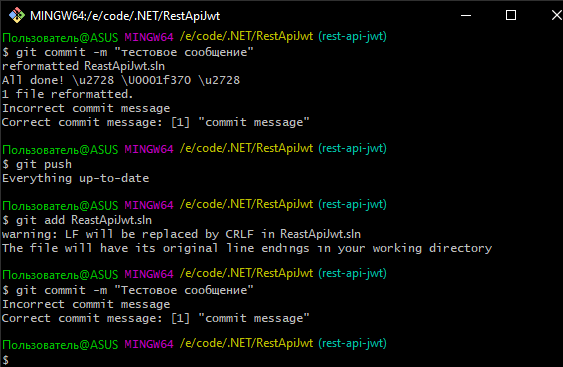
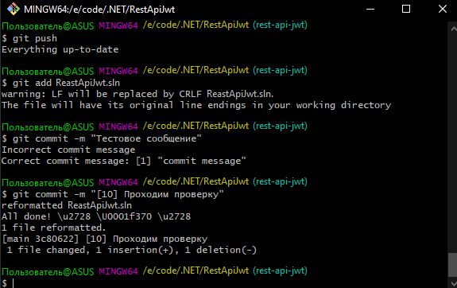
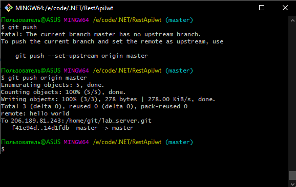

# Simple RESTful-API ToDo List with JWT-Authorization 
# [Реализация простого Rest API ToDoList на .NET](#lab1)
# [Статический анализ кода](#lab5)
# [Git-Hooks](#lab8)

## Реализация простого Rest API ToDoList на .NET
### Регистрация пользователя

### Получение списка задач пользователя, которого не существует

### Получение списка задач пользователя, который существует

### Добавить задачу пользователя

### Удаление задачи пользователя

## Использование Case-инструментов для улучшения качества кода(Roslyn, PVS-Studio, ReSharper, Security Code Scan, Roslynator)
### PVS-Studio — проприетарный статический анализатор кода для программ, написанных на С, C++, C++/CLI, C++/CX, C# и на Java. https://pvs-studio.com/ru/
При изменении названия атрибута класса видим одно незначительно замечание

После исправления ошибки

### Анализатор кода Roslyn. Roslyn – платформа с открытым исходным кодом, разрабатываемая корпорацией Microsoft, и содержащая в себе компиляторы и средства для разбора и анализа кода, написанного на языках программирования C# и Visual Basic. https://github.com/dotnet/roslyn
Та же очепятка, выставляем минимальный порог 

Выставляем максимальный порог

После исправления ошибки

### ReSharper — дополнение, разработанное компанией JetBrains для повышения продуктивности работы в Microsoft Visual Studio. https://www.jetbrains.com/ru-ru/resharper/
Запускаем анализ из ReSharper

Исправляем автоматически ошибки с помощью ReSharper

Остались только ошибки с именем(забыл, что правильно Rest, а не Reast:D)

### Security Code Scan - статический анализатор кода для .NET. https://security-code-scan.github.io/
Как видно на скриншоте ниже, выдаётся только одно предупреждение.

### Roslynator - Коллекция из 500+ анализаторов , рефакторингов и исправлений для C# на платформе Roslyn. https://github.com/JosefPihrt/Roslynator

То самое сообщение после всех исправлений.

## Настройка собственного git-сервера. Использование git-хуков совместно с case-инструментами

### commit-msg

### pre-commit 

#!/bin/sh

FILES=$(git diff-tree --no-commit-id --name-only HEAD)

for file in $FILES; do
    echo $file
    if [[ "$file" == *".sln" ]]; then
        $(black ${file})
    fi
done

### pre-receive

 #!/bin/bash

echo "Hello World" 

